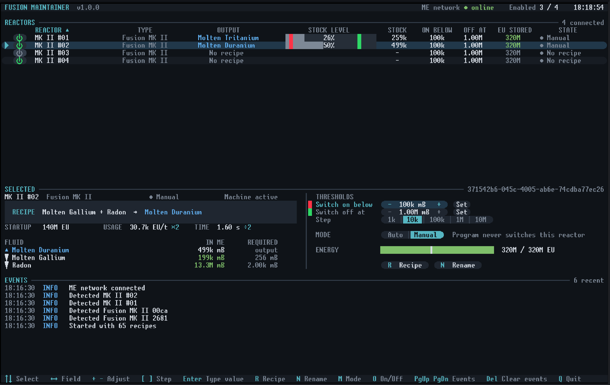

# GTNH-OC-fusion-maintainer

OpenComputers program for GT New Horizons that keeps fusion reactor products stocked in an ME network.
Each reactor is switched on when its product drops below a lower threshold and switched off when it
reaches an upper threshold. Recipes, thresholds and control mode are set on screen while the program runs.

<p align="center">
  
</p>

## Content

- [Features](#features)
- [Requirements](#requirements)
- [Installation](#installation)
- [Update](#update)
- [Setup](#setup)
- [Usage](#usage)
- [Control](#control)
- [Configuration](#configuration)
- [Recipe table](#recipe-table)

<a id="features"></a>

## Features

- Detects Fusion Reactors MK I to MK V and Compact Fusion Computers MK I to MK V connected to the computer
- Built-in table of all fusion recipes, searchable on screen
- Switch-on and switch-off thresholds per reactor, adjustable with keyboard or mouse
- Input check against the ME network and startup EU check before switching on
- Auto and Manual mode and an on/off button per reactor
- Sortable reactor table with stock level bars
- Settings are saved and kept when updating
- Event log on screen, in a file and optionally in Discord

<a id="requirements"></a>

## Requirements

- Graphics Card (Tier 3)
- Screen (Tier 3), resolution 160×50
- Central Processing Unit (Tier 3)
- Memory (Tier 3.5): 2
- Hard Disk Drive
- EEPROM (Lua BIOS)
- Internet Card, for installation and Discord notifications
- OpenOS

Built for GTNH 2.9.0-beta-3 (GT5-Unofficial 5.09.54.133).

<a id="installation"></a>

## Installation

```shell
mkdir /home/fusion-maintainer
cd /home/fusion-maintainer
wget -f https://raw.githubusercontent.com/mpmxyz/ocprograms/master/home/bin/tar.lua /bin/tar.lua
wget -f https://github.com/Leidiland/GTNH-OC-fusion-maintainer/releases/latest/download/FusionMaintainer.tar
tar -xf FusionMaintainer.tar
rm FusionMaintainer.tar
```

Start the program:

```shell
/home/fusion-maintainer/main
```

To start it on boot, add the same line to `/home/.shrc`.

<a id="update"></a>

## Update

```shell
/home/fusion-maintainer/update
```

`config.lua` and saved settings are kept. Add `--reset-config` to restore the default config or
`--config=<path>` to install another file. The replaced config is saved as `config.lua.bak`.

<a id="setup"></a>

## Setup

- Connect every fusion controller to the computer with an Adapter placed against the controller,
  or with an MFU bound to the controller inside an Adapter.
- Connect a block ME Interface or an ME Controller of the network that stores
  the reactor products and inputs with an Adapter. Cable-mounted ME Interfaces, ME Fluid Interfaces
  and ME Dual Interfaces cannot read the network.
- Deliver the reactor products into that ME network, for example with an Output Hatch (ME).
- Supply the reactor inputs from outside the program. Inputs are checked, never requested.

Controllers are detected automatically when the program starts and whenever components are added or removed.

<a id="usage"></a>

## Usage

The screen is split into four areas:

| Area | Content |
|---|---|
| Reactors | All detected reactors with on/off button, product, stock level bar, thresholds, stored EU and state |
| Selected | Recipe, fluid amounts in the ME network, thresholds, step size, mode and energy of the selected reactor |
| Events | Switching actions, warnings and setting changes |
| Footer | Keyboard shortcuts |

The stock level bar shows the stock as a percentage of the switch-off threshold, up to 100%, with a red marker
at the switch-on threshold and a green marker at the switch-off threshold.

Usage and time in the Selected area include the overclocks the reactor applies to its recipe. The overclock
multiplier is shown next to both values, for example `30.7k EU/t ×2` and `1.60 s ÷2`.

Newly detected reactors start in Manual mode without a recipe. To put a reactor under control:

1. Select the reactor
2. Press <kbd>R</kbd> and choose its recipe
3. Set the thresholds
4. Press <kbd>M</kbd> to switch to Auto

#### Controls

| Key | Action |
|---|---|
| <kbd>↑</kbd> <kbd>↓</kbd> | Select reactor |
| <kbd>←</kbd> <kbd>→</kbd> | Switch between the switch-on and switch-off threshold |
| <kbd>+</kbd> <kbd>-</kbd> | Adjust the active threshold by the step size |
| <kbd>[</kbd> <kbd>]</kbd> | Change step size |
| <kbd>Enter</kbd> | Type an exact threshold, suffixes k, M, G and T are supported |
| <kbd>R</kbd> | Choose recipe |
| <kbd>N</kbd> | Rename reactor |
| <kbd>M</kbd> | Toggle Auto and Manual |
| <kbd>O</kbd> | Switch the reactor on or off, sets Manual mode |
| <kbd>PgUp</kbd> <kbd>PgDn</kbd> | Scroll events |
| <kbd>Del</kbd> | Clear events |
| <kbd>Q</kbd> | Quit |

Rows and buttons can be clicked. Click a column header to sort the table. The mouse wheel scrolls the reactor list and the events.
In the recipe dialog, type to search by fluid name and select a recipe with <kbd>Enter</kbd> or by clicking it twice.

#### States

| State | Meaning |
|---|---|
| Running | Switched on and processing |
| Starting | Switched on, not processing yet |
| Stalled | Switched on but not processing for `stallTimeout` seconds |
| Idle | Stock is at or above the switch-on threshold |
| Charging | Stored EU is below the recipe startup EU |
| Missing inputs | An input in the ME network is below the required amount |
| Capacity low | Recipe startup EU exceeds the reactor EU capacity |
| Manual | Not switched by the program |
| No recipe | No recipe selected |
| No ME data | The ME network could not be read |
| Offline | The controller could not be reached |

<a id="control"></a>

## Control

A reactor in Auto mode is switched on when all of the following are true:

- Stock is below the switch-on threshold
- Every input is available in at least the recipe amount multiplied by `inputBatches`
- The recipe startup EU fits into the reactor EU capacity
- Stored EU is at least the recipe startup EU

A running reactor is switched off when its stock reaches the switch-off threshold or an input drops below the required amount.

Reactors in Manual mode and reactors without a recipe are never switched.
When the ME network cannot be read, no reactor is switched.
Quitting the program leaves all reactors in their current state.

> [!CAUTION]
> A reactor in Auto mode that is disabled with a Soft Mallet is switched on again when the conditions are met.
> Use Manual mode to control a reactor by hand.

Fluids are matched by internal name. When a name is not present in the ME network, the fluid label is used instead.

<a id="configuration"></a>

## Configuration

Settings changed on screen are stored in `data/reactors.dat`. General configuration is in `config.lua`,
created on first start.

| Field | Default | Description |
|---|---|---|
| `pollInterval` | `5` | Seconds between ME network checks |
| `stallTimeout` | `60` | Seconds a switched-on reactor may stay inactive before a warning, `0` disables |
| `network.address` | `nil` | ME Interface or ME Controller address, the first one found is used when empty |
| `reactors.discover` | `true` | Detect fusion controllers automatically |
| `reactors.addresses` | `{}` | Controller addresses used in addition to detected ones |
| `defaults.lowThreshold` | `100000` | Switch-on threshold in mB for new reactors |
| `defaults.highThreshold` | `1000000` | Switch-off threshold in mB for new reactors |
| `defaults.inputBatches` | `16` | Recipe runs of each input required before switching on |
| `steps` | `1k` to `10M` | Step sizes for threshold adjustment |
| `log.file` | `fusion-maintainer.log` | Log file in the program folder |
| `log.maxFileSize` | `262144` | Bytes before the log file is rotated to `.old` |
| `log.timeZone` | `0` | Hours offset from UTC for timestamps |
| `log.discordWebhookUrl` | `""` | Discord webhook for notifications |
| `log.discordLevel` | `warning` | Minimum level sent to Discord |
| `customRecipes` | `{}` | Recipes missing from the built-in table |

Custom recipes use the same format as `recipes.lua` and replace built-in recipes with the same output and inputs:

```lua
customRecipes = {
  {
    output = {name = "plasma.helium", label = "Helium Plasma", amount = 125},
    inputs = {
      {name = "deuterium", label = "Deuterium", amount = 125},
      {name = "tritium", label = "Tritium", amount = 125}
    },
    startupEu = 40000000,
    eut = 4096,
    duration = 16
  },
},
```

Run `fluids` in the program folder to list fluids in the ME network with internal name, label and amount.
An optional argument filters by name or label.

```shell
fluids plasma
```

<a id="recipe-table"></a>

## Recipe table

`recipes.lua` is generated from the GT5-Unofficial sources, which also contain the fusion recipes of
GT++, BartWorks and GoodGenerator. To regenerate it for another version:

```shell
git clone --branch 5.09.54.133 --depth 1 https://github.com/GTNewHorizons/GT5-Unofficial.git
python tools/generate-recipes.py GT5-Unofficial --source-version 5.09.54.133
```

The generator exits with an error listing every recipe whose fluids it cannot resolve.
